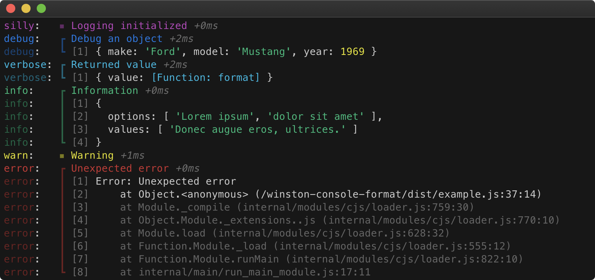

# Winston@3 console format

[](https://www.npmjs.com/package/winston-console-format)
[](https://npmcharts.com/compare/winston-console-format?minimal=true)
[](https://david-dm.org/duccio/winston-console-format)
[](https://travis-ci.com/duccio/winston-console-format)
[](https://codecov.io/github/duccio/winston-console-format)
[](https://snyk.io/test/github/duccio/winston-console-format)

Winston@3 console formatter for debugging purposes using util.inspect().

## Demo



## Install

```bash
npm install winston-console-format
```

## Usage TypeScript

```typescript
import { createLogger, format, transports } from "winston";
import { consoleFormat } from "winston-console-format";
import util from "util";

const logger = createLogger({
  level: "silly",
  format: format.combine(
    format.timestamp(),
    format.ms(),
    format.errors({ stack: true }),
    format.splat(),
    format.json()
  ),
  defaultMeta: { service: "Test" },
  transports: [
    new transports.Console({
      format: format.combine(
        format.colorize({ all: true }),
        format.padLevels(),
        consoleFormat({
          showMeta: true,
          metaStrip: ["timestamp", "service"],
          inspectOptions: {
            depth: Infinity,
            colors: true,
            maxArrayLength: Infinity,
            breakLength: 120,
            compact: Infinity,
          },
        })
      ),
    }),
  ],
});

logger.silly("Logging initialized");
logger.debug("Debug an object", { make: "Ford", model: "Mustang", year: 1969 });
logger.verbose("Returned value", { value: util.format });
logger.info("Information", {
  options: ["Lorem ipsum", "dolor sit amet"],
  values: ["Donec augue eros, ultrices."],
});
logger.warn("Warning");
logger.error(new Error("Unexpected error"));
```

## Usage JavaScript

```js
const { createLogger, format, transports } = require("winston");
const { consoleFormat } = require("winston-console-format");
const util = require("util");

const logger = createLogger({
  level: "silly",
  format: format.combine(
    format.timestamp(),
    format.ms(),
    format.errors({ stack: true }),
    format.splat(),
    format.json()
  ),
  defaultMeta: { service: "Test" },
  transports: [
    new transports.Console({
      format: format.combine(
        format.colorize({ all: true }),
        format.padLevels(),
        consoleFormat({
          showMeta: true,
          metaStrip: ["timestamp", "service"],
          inspectOptions: {
            depth: Infinity,
            colors: true,
            maxArrayLength: Infinity,
            breakLength: 120,
            compact: Infinity,
          },
        })
      ),
    }),
  ],
});

logger.silly("Logging initialized");
logger.debug("Debug an object", { make: "Ford", model: "Mustang", year: 1969 });
logger.verbose("Returned value", { value: util.format });
logger.info("Information", {
  options: ["Lorem ipsum", "dolor sit amet"],
  values: ["Donec augue eros, ultrices."],
});
logger.warn("Warning");
logger.error(new Error("Unexpected error"));
```

## API

## consoleFormat(options)

### options

Configuration object.<br><br>Type: `ConsoleFormatOptions`

### options.showMeta

Show/hide meta object(s).<br><br> Type: `boolean`<br> Default: `true`

### options.metaStrip

Array of meta-object properties to hide.<br><br> Type: `string[]`<br> Default: `[]`

### options.inspectOptions

`util.inspect()` configuration object.<br><br> Type: `Object`<br> Default: [Node util.inspect(object[, options])](https://nodejs.org/api/util.html#util_util_inspect_object_options)
